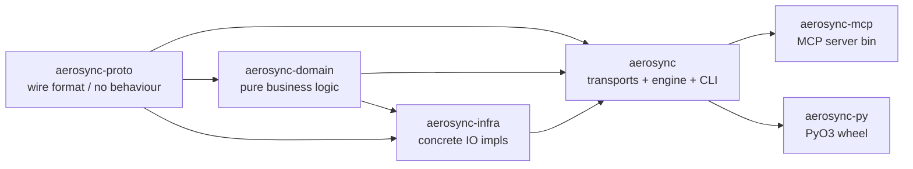

# AeroSync 架构与功能设计文档

> **版本**：v0.2 设计基准  
> **用途**：DDD 领域设计参考、功能补充规划  
> **目标**：打造跨网络、高效、可靠的 Agent 间文件传输 CLI 工具

---

## 一、项目定位与核心目标

### 1.1 产品定位

AeroSync 是一个**跨网络文件传输 CLI 工具**，专为 Agent-to-Agent 场景设计：

- **主路径**：两端均安装 AeroSync CLI，使用 QUIC 协议高速传输
- **降级路径**：对端无 AeroSync，降级为标准 HTTP / FTP / S3 协议
- **场景特征**：
  - 大文件（GB 级）：分片上传、断点续传、多流并发
  - 小文件批量（千级）：低延迟、高并发、流水线化

### 1.2 核心目标

| 目标 | 指标 |
|------|------|
| 传输速度 | QUIC 模式 ≥ 3x HTTP；千兆网络 ≥ 90% 带宽利用 |
| 可靠性 | 传输成功率 ≥ 99%，支持断点续传 |
| 安全性 | 全程加密（TLS 1.3 / QUIC），Token 认证，SHA-256 完整性校验 |
| 易用性 | 单命令发送/接收，零配置可用，自动协议降级 |
| 可观测 | 实时进度，操作审计日志，健康检查接口 |

---

## 二、Workspace 布局（v0.3.0 实际状态）

> **说明**：本节自 v0.3.0 起以 **当前实际架构** 为准。v0.2.x 时代的"现有功能盘点 / 已实现 / 部分实现 / 完全缺失"清单已完成历史使命（参见 `CHANGELOG.md` 与 `docs/v0.3.0-frozen-api.md` §8 的基准统计）。
>
> v0.3.0 的核心任务是 **预防性 DDD 分层**——在 RFC-004（WAN，约 +3 K LoC）落地前完成 crate 拆分。详细动机见 `docs/v0.3.0-refactor-plan.md` §1。

### 2.1 Workspace 成员（5 个 crate）

```text
AeroSync workspace (root Cargo.toml lines 213-220)
├── aerosync-proto              # 线协议 protobuf 绑定（RFC-002 wire format）
├── aerosync-domain             # 纯领域层：错误类型、metadata、storage 抽象
├── aerosync-infra              # 基础设施层：TLS、审计、resume 持久化
├── aerosync                    # 根 crate：传输引擎、所有 transports、Receipt、CLI
└── aerosync-mcp                # MCP server 二进制（stdio + http transports）
└── aerosync-py                 # PyO3 binding（subpackage，发布到 PyPI，不在 crates.io）
```

依赖方向严格自上而下，**无环路**：

```text
aerosync-proto  ◄─┐
                  ├── aerosync-domain  ◄── aerosync-infra  ◄── aerosync  ◄── aerosync-mcp
                  │                                              ▲
                  └──────────────────────────────────────────────┴── aerosync-py
```

Mermaid 视角（同一关系，便于在 README 中嵌入）：



### 2.2 v0.3.0 落地状态（commit 视角）

| Phase | 工作内容 | Commit |
|-------|----------|--------|
| 0 | Freeze public API contract | `cbc0045` |
| 1   | 创建 `aerosync-domain` / `aerosync-infra` crate skeleton | `5ee113d` |
| 1b  | TLS provider bootstrap → infra | `513566f` |
| 1c  | `AeroSyncError` + `Result` → domain | `6ce2989` |
| 1d  | `AuditLogger` → infra | `9647c3b` |
| 1e  | `MetadataBuilder` + sealing → domain | `49ba268` |
| 2.1a | `ResumeStorage` trait + `ResumeState` 值对象 → domain | `8d7b094` |
| 2.1b | `HistoryStorage` trait + `HistoryEntry/Query/Label` → domain | `8326d5c` |
| 2.2  | `ResumeStore` → infra + crash-safe `save` (tmp+rename) | `2522b51` |
| 2.3  | `HistoryStore impl HistoryStorage`（文件位置仍在 `src/core/history.rs`，移动延后） | `158dc07` |
| 4    | 文档闭环（本节 + Phase 4b/4c） | `0d1b940`、`67934f3`、当前 commit |

v0.3.0-rc1 收口状态：

- **Phase 2.3 文件迁移**：`history.rs` 已在 Phase 3.4b 移到 `aerosync-infra/src/history.rs`（`Receipt` 已先一步在 3.4a 升到 domain，循环依赖解开）。
- **Phase 2.4 / 3.4d**：`TransferEngine` / `AutoAdapter` / `HttpTransfer` 已全部接受 `Arc<dyn ResumeStorage>` / `Arc<dyn HistoryStorage>`，并保留具体类型 builder 作为向后兼容入口（commit `3da365a` + `b7c024d`）。
- **Phase 3**：`SessionId` / `SessionKind` / `SessionStatus` / `FileManifest` / `FileEntry` / `TransferSession` / `EventLog` / `ReceiptLedger` / `ReceiptEntry` 全部落地于 `aerosync-domain` 的 `session` / `manifest` / `transfer_session` / `receipt` 模块（commits `2d53c0f`、`f27fac6` 等）。
- **Phase 4d**：`aerosync_infra::resume` 上的 `#[allow(missing_docs)]` 已退役（见 `aerosync-infra/src/lib.rs` 头部块注释），全 workspace `cargo doc -D warnings` 干净。

延后到 v0.4（与 WAN ship 合批，避免重复破坏 API）：

- **Phase 3.4e/f/g**：`TransferEngine` ↔ `TransferSession` 集成、PyO3 `Receipt.session_id` getter、protobuf wire 加 `session_id` 字段——三者形状互锁，统一在 v0.4 设计 ReceiverSession 时一次完成。
- **Phase 3.5**：`ReceiverSession` 接 `FileReceiver.accept` 路径，与上面 3.4e 同批。

---

## 三、Crate 职责详解

### 3.1 `aerosync-proto`

**定位**：线协议 / wire format only，无行为。

| 内容 | 说明 |
|------|------|
| `proto/aerosync/wire/v1.proto` | 单一真理源（Single source of truth），ALPN `aerosync/1` 下的字节布局 |
| `prost` 生成的 Rust 类型 | `Handshake`、`TransferStart`、`Metadata`（RFC-003）、`ControlFrame`、`ReceiptFrame`、所有 enum |
| 字段编号保留规则 | `1-19` 系统、`20-99` SDK 已知、`≥100` 系统扩展、`≥200` SDK 用、`≥1000` 用户扩展（详见 frozen-api §2.3） |

**依赖**：`prost`、`prost-types`，**无运行时依赖**。

### 3.2 `aerosync-domain` —— 纯领域层

**定位**：纯业务逻辑，**不允许** tokio I/O / 文件系统 / 网络。允许 `tokio::sync::{watch, mpsc}`（见 refactor-plan §4 D1）。

| 模块 | 内容 | 来源 |
|------|------|------|
| `error` | `AeroSyncError`（thiserror 枚举，含传输 / IO / 协议 / 安全等 12+ 变体）、`Result<T>` 别名 | 自 `src/core/error.rs` 迁入（`6ce2989`） |
| `metadata` | `MetadataBuilder`、`MetadataJson` 适配器、`validate_sealed`、`empty_metadata`、所有 `MAX_*` 限额常量、`SYSTEM_FIELD_NAMES`、`label_to_lifecycle` / `lifecycle_to_label` | 自 `src/core/metadata.rs` 迁入（`49ba268`） |
| `storage` | **trait**：`ResumeStorage`（`put` / `get` / `delete` / `list`）、`HistoryStorage`（`append` / `query` / `recent` / `delete_older_than`）；**值对象**：`ChunkState`、`ResumeState`、`HistoryEntry`、`HistoryQuery`、`HistoryFilter`、`ReceiptStateLabel`；**常量**：`DEFAULT_CHUNK_SIZE = 32 MiB` | trait 来自 Phase 2.1a/2.1b（`8d7b094`、`8326d5c`） |

Crate 根再 re-export `AeroSyncError` / `Result`，让 infra-side 调用者写 `use aerosync_domain::{AeroSyncError, Result}` 而非完整路径。

**依赖**：`aerosync-proto`、`prost`、`tokio`（只用 sync）、`thiserror`、`serde`、`async-trait`、`uuid`（带 `serde` feature）、`chrono`。

**Phase 3 计划**：新增 `session` 模块（`TransferSession` 聚合根 + `SessionId`、`SessionKind`、`SessionStatus`）、`manifest` 模块（`FileManifest`、`FileEntry`、`Hash`、`ChunkPlan`）、`receipt` 模块（从根 crate 迁入纯状态机部分）。

### 3.3 `aerosync-infra` —— 基础设施层

**定位**：领域 trait 的 IO 实现 + 进程级 bootstrap。

| 模块 | 内容 | 来源 |
|------|------|------|
| `tls` | `ensure_rustls_provider_installed`——一次性安装 `rustls::crypto::ring` provider | 自 `src/core/tls.rs` 迁入（`513566f`） |
| `audit` | `AuditLogger`、`AuditEntry`、`AuditEvent`、`AuditRecord`、`AuditResult`、`Direction`，append-only JSONL | 自 `src/core/audit.rs` 迁入（`9647c3b`） |
| `resume` | `ResumeStore`——文件后端 JSON 实现，`impl ResumeStorage`；`save` 使用 tmp+rename **原子写**（`2522b51` 修复了 v0.2.1 的部分写入风险） | 自 `src/core/resume.rs` 迁入（`2522b51`） |

**依赖**：`aerosync-domain`、`aerosync-proto`、`tokio`（fs/io/sync）、`async-trait`、`rcgen`、`rustls`、`serde`、`serde_json`、`tempfile`、`tracing`、`uuid`、`chrono`。

**Phase 2.3 / 3 计划**：`history` 模块（`HistoryStore` 当前已 `impl HistoryStorage`，但物理仍在 `src/core/history.rs`，因依赖根 crate 的 `Receipt`）；`config` 模块（拆分 `src/config.rs` 的 TOML 加载逻辑）。

### 3.4 `aerosync` —— 应用层 + 协议层（根 crate）

**定位**：所有 transports（HTTP / QUIC / S3 / FTP）、传输引擎、Receipt 状态机 + registry、mDNS discovery、CLI 二进制 `aerosync`、MCP-helpers。

主要子模块（`src/core/*`、`src/protocols/*`、`src/wan/*`）：

| 子模块 | 关键类型 | 备注 |
|--------|----------|------|
| `core::transfer` | `TransferEngine`、`TransferConfig`、`TransferTask`、`ProtocolAdapter`、`ProtocolProgress` | 核心调度 / 任务管理 |
| `core::server` | `FileReceiver`、`ReceivedFile`、`ServerConfig`、`ServerStatus`、`TlsConfig` | HTTP/HTTPS 接收方 + Receiver lifecycle |
| `core::receipt` | `Receipt`、`Sender`、`Receiver` (= `RxSide`)、`State`、`Event`、`Outcome`、`empty_metadata` | RFC-002 §6.4 receipt 状态机 |
| `core::receipt_registry` | `ReceiptRegistry` | tokio-watch 协调（推迟到 Phase 3 才能搬出根 crate） |
| `core::receipts_http` | `/v1/receipts/*` axum router、`AckBody`、`NackBody`、`CancelBody`、`StateView`、`IdempotencyCache` | 接收方 HTTP 控制面 |
| `core::history` | `HistoryStore`、`HistoryEntry/Filter/Query`、`ReceiptStateLabel` re-exports | 仍在根 crate；impl 已对齐 `HistoryStorage` trait |
| `core::progress` / `core::preflight` / `core::file_manager` / `core::sniff` / `core::routing` / `core::capabilities` / `core::auth` / `core::metrics` / `core::incoming_file` / `core::error_advice` | 应用服务工具 | Phase 1-2 范围内未动 |
| `core::discovery` | `AeroSyncMdns`、`AeroSyncPeer`、`MdnsHandle` | feature = `mdns` |
| `protocols::adapter::AutoAdapter` | 协议自动选择 + builder | feature 组合无关 |
| `protocols::http` | `HttpConfig`、`HttpTransfer`、`HttpReceiptAck`、`HttpReceiptDecision` | Batch B/D.5 wire 扩展 |
| `protocols::quic` / `protocols::quic_receipt` | `QuicConfig`、`QuicTransfer`、`ReceiptCodec`、`encode_*` / `read_*` 帧编解码 | feature = `quic`，Batch C |
| `protocols::s3` / `protocols::ftp` / `protocols::ratelimit` / `protocols::circuit_breaker` / `protocols::traits` | 各 transport + 公共 trait | feature gates 见 frozen-api §1.5 |
| `wan::rendezvous` / `wan::relay` | RFC-004 占位（v0.4.0 才落地） | features `wan-rendezvous` / `wan-relay`（no-op） |

**关键 re-export 桥**（`src/core/mod.rs`）：

```rust
pub use aerosync_infra::audit;       // 让 aerosync::core::audit::* 仍可解析
pub use aerosync_domain::error;      // 让 aerosync::core::error::* 仍可解析
pub use aerosync_domain::metadata;   // 让 aerosync::core::metadata::* 仍可解析
pub use aerosync_infra::resume;      // 让 aerosync::core::resume::* 仍可解析
pub(crate) use aerosync_infra::tls;  // 内部路径 crate::core::tls 仍可解析
```

`src/lib.rs` 顶层再 `pub use crate::core::{AeroSyncError, AuditLogger, …, TransferTask}`，所有 frozen-api §1.1 / §1.2 列出的符号 **零变化** 全部可解析。

### 3.5 `aerosync-mcp`

**定位**：MCP server 二进制（基于 `rmcp`），同时支持 stdio 与 streamable HTTP transports。11 个工具（`send_file`、`send_directory`、`start_receiver`、`request_file`、`stop_receiver`、`get_receiver_status`、`list_history`、`discover_receivers`、`get_transfer_status`、`wait_receipt`、`cancel_receipt`），完整清单与冻结契约见 `docs/v0.3.0-frozen-api.md` §4。

**依赖**：根 `aerosync` crate（**不直接依赖** `aerosync-domain` / `aerosync-infra`，见 refactor-plan §4 D2）。

### 3.6 `aerosync-py`（subpackage）

**定位**：PyO3 + maturin 构建的 abi3 wheel，发布到 PyPI（不发到 crates.io）。Python 公开 API 见 frozen-api §3。

**依赖**：根 `aerosync` crate（同 D2 决策）。

---

## 四、DDD 分层与依赖关系

### 4.1 三层模型

v0.3.0 的 crate 拆分对应以下 DDD 分层：

```text
┌─────────────────────────────────────────────────────────────────┐
│  Presentation 层（CLI / MCP / Python SDK）                       │
│  ─ aerosync-mcp、aerosync-py、src/main.rs                        │
│    职责：协议封装、参数解析、错误格式化                          │
└────────────────────────────┬────────────────────────────────────┘
                             │ 依赖
                             ▼
┌─────────────────────────────────────────────────────────────────┐
│  Application 层（应用服务 + 传输引擎 + transports）              │
│  ─ aerosync (root crate)                                         │
│    职责：TransferEngine、FileReceiver、Receipt 状态机、          │
│         HTTP / QUIC / S3 / FTP transports、Auth 流程、           │
│         mDNS discovery、receipt HTTP 控制面                      │
└──────────────────┬──────────────────────────┬───────────────────┘
                   │ 依赖                     │ 依赖
                   ▼                          ▼
┌─────────────────────────┐   ┌──────────────────────────────────┐
│  Infrastructure 层       │   │  Domain 层（纯业务，无 IO）       │
│  ─ aerosync-infra        │──►│  ─ aerosync-domain                │
│    职责：TLS bootstrap、 │   │    职责：错误类型、metadata 构建/  │
│         审计 JSONL、     │   │         校验、storage trait + 值   │
│         resume JSON 持久 │   │         对象（Phase 3 增 session/ │
│         化（原子写）     │   │         manifest/receipt）         │
└─────────────────────────┘   └────────────────┬─────────────────┘
                                                │ 依赖
                                                ▼
                                ┌──────────────────────────────────┐
                                │  Wire 层（线协议）                │
                                │  ─ aerosync-proto                 │
                                │    职责：protobuf 字节布局        │
                                └──────────────────────────────────┘
```

层间规则：

- **Domain 层不允许引用 infra / root 类型**——若需要异步通知，仅可使用 `tokio::sync::{watch, mpsc}`。
- **Infra 层只实现 domain 定义的 trait**，不引入 domain 之外的业务概念。
- **Application 层（root crate）通过 trait 注入消费 infra**——v0.3.0 已就位 trait，但 `TransferEngine` / `FileReceiver` 的 `Arc<dyn …>` 注入仍待 Phase 2.4。

### 4.2 Storage 抽象当前状态

```rust
// 在 aerosync-domain::storage 中（commit 8d7b094 + 8326d5c）
#[async_trait]
pub trait ResumeStorage: Send + Sync + 'static {
    async fn put(&self, snapshot: ResumeState) -> Result<()>;
    async fn get(&self, task_id: Uuid) -> Result<Option<ResumeState>>;
    async fn delete(&self, task_id: Uuid) -> Result<()>;
    async fn list(&self) -> Result<Vec<ResumeState>>;
}

#[async_trait]
pub trait HistoryStorage: Send + Sync + 'static {
    async fn append(&self, entry: HistoryEntry) -> Result<()>;
    async fn query(&self, query: HistoryQuery) -> Result<Vec<HistoryEntry>>;
    async fn recent(&self, limit: usize) -> Result<Vec<HistoryEntry>>;
    async fn delete_older_than(&self, cutoff: DateTime<Utc>) -> Result<usize>;
}
```

| 实现 | 位置 | 状态 |
|------|------|------|
| `ResumeStore impl ResumeStorage` | `aerosync-infra::resume`（commit `2522b51`） | ✅ 已就位；`save` 用 tmp+rename 原子写 |
| `HistoryStore impl HistoryStorage` | `src/core/history.rs`（commit `158dc07`） | ✅ trait 已 impl；文件位置因循环依赖（`spawn_watch_bridge` 需根 crate `Receipt`）暂留根 crate |
| `TransferEngine` / `FileReceiver` 通过 `Arc<dyn …>` 注入 | `src/core/transfer.rs`、`src/core/server.rs` | ⏳ Phase 2.4 / Phase 3——目前仍持有具体类型 |

### 4.3 向后兼容契约

`docs/v0.3.0-frozen-api.md` §1.1–§1.3 列出每一个对外可见符号。v0.3.0 的所有 crate 拆分均通过根 crate 的 re-export 桥（§3.4 末尾）保留旧 import 路径，例如：

| 旧路径（v0.2.x 调用方） | v0.3.0 实际定义位置 | 解析方式 |
|------------------------|---------------------|----------|
| `aerosync::core::error::AeroSyncError` | `aerosync_domain::error::AeroSyncError` | `pub use aerosync_domain::error;` in `src/core/mod.rs` |
| `aerosync::core::resume::ResumeStore` | `aerosync_infra::resume::ResumeStore` | `pub use aerosync_infra::resume;` in `src/core/mod.rs` |
| `aerosync::core::audit::AuditLogger` | `aerosync_infra::audit::AuditLogger` | `pub use aerosync_infra::audit;` in `src/core/mod.rs` |
| `aerosync::core::metadata::MetadataBuilder` | `aerosync_domain::metadata::MetadataBuilder` | `pub use aerosync_domain::metadata;` in `src/core/mod.rs` |
| `aerosync::AeroSyncError` / `aerosync::ResumeStore` / … | （同上） | `pub use crate::core::{…};` in `src/lib.rs` |

外部 embedder（Python SDK、MCP、CLI 用户）**零代码改动**。详见 `docs/MIGRATION-v0.3.0.md`。

---

## 五、CLI 接口设计

### 5.1 命令结构

```
aerosync [全局选项] <子命令> [子命令选项]

全局选项：
  -v, --verbose          详细日志
  --config <path>        指定配置文件（默认 ~/.aerosync/config.toml）
  --token <token>        认证 Token
  --no-color             禁用颜色输出

子命令：
  send       发送文件或目录
  receive    启动接收端监听
  token      Token 管理
  status     查看传输状态
  history    查看传输历史
  config     配置管理
```

### 5.2 核心命令详情

#### `aerosync send`

```
aerosync send <源路径> <目标地址> [选项]

示例：
  aerosync send ./data agent2.local:8080
  aerosync send ./data s3://bucket/path --protocol s3
  aerosync send ./bigfile.tar host:8080 --chunk-size 64M --parallel 8
  aerosync send ./dir/ host:8080 --recursive --compress

参数：
  <源路径>               文件或目录路径
  <目标地址>             host:port 或 protocol://... 格式

选项：
  --protocol <p>         强制指定协议：quic | http | s3 | ftp（默认：自动）
  -r, --recursive        递归传输目录
  --chunk-size <size>    分片大小（默认：4MB，大文件自动调整）
  --parallel <n>         并发分片数（默认：4）
  --bandwidth <rate>     限速，如 10MB/s
  --compress             传输前压缩
  --verify               传输后校验 SHA-256（默认：开启）
  --resume               断点续传（默认：开启）
  --timeout <secs>       超时时间
  --dry-run              预检：不实际传输，只显示计划
```

#### `aerosync receive`

```
aerosync receive [选项]

示例：
  aerosync receive
  aerosync receive --port 8080 --save-to ./downloads
  aerosync receive --enable-quic --one-shot

选项：
  --port <port>          HTTP 监听端口（默认：7788）
  --quic-port <port>     QUIC 监听端口（默认：7789）
  --save-to <dir>        文件保存目录（默认：./received）
  --enable-quic          启用 QUIC 接收（默认：自动）
  --auth-token <token>   要求发送方携带此 Token
  --max-size <size>      最大单文件大小
  --one-shot             接收一次后自动退出
  --overwrite            允许覆盖同名文件
```

#### `aerosync token`

```
aerosync token <子命令>

子命令：
  generate               生成新 Token
  list                   列出所有有效 Token
  revoke <token-id>      吊销指定 Token
  verify <token>         验证 Token 是否有效
```

### 5.3 协议自动协商流程

```
发送方启动
    │
    ▼
尝试连接 <host>:7789 (QUIC)
    │
    ├── 成功 ──► 使用 QUIC 协议（高性能模式）
    │
    └── 失败 ──► 尝试 HTTP <host>:7788
                    │
                    ├── 成功 ──► 使用 HTTP 协议（降级模式）
                    │
                    └── 失败 ──► 使用用户指定的 --protocol
                                （S3 / FTP / 报错）
```

---

## 六、关键技术方案

### 6.1 大文件传输：分片 + 并发

```
文件 (10GB)
    │
    ▼ 切片
┌──────┬──────┬──────┬──────┐
│ 0-4M │ 4-8M │ 8-12M│ ...  │  每片 4MB（可配置）
└──┬───┴──┬───┴──┬───┴──────┘
   │      │      │
   ▼      ▼      ▼
 Worker  Worker  Worker      并发 4 个流（QUIC 多路复用）
   │      │      │
   └──────┴──────┘
           │
           ▼
      接收方合并 + SHA-256 校验
```

**实现要点**：
- 使用 `tokio::fs::File` + `seek()` 实现无拷贝分片读取
- QUIC 天然支持多路复用，每个分片一个 stream
- HTTP 使用 chunked transfer encoding + Content-Range
- 每片有独立 SHA-256，最终全文件再校验一次

### 6.2 小文件批量：流水线化

```
文件列表 [f1, f2, f3, ... f1000]
    │
    ▼ 生产者
┌─────────────────┐
│   FileScanner   │  扫描目录，生成文件清单
└────────┬────────┘
         │ channel
         ▼ 消费者池
┌──┐ ┌──┐ ├──┐ ┌──┐
│W1│ │W2│ │W3│ │W4│  16 个并发 Worker
└──┘ └──┘ └──┘ └──┘
         │
         ▼
   进度聚合器（单个 Receiver）
         │
         ▼
   实时进度输出到 CLI
```

**实现要点**：
- `tokio::sync::mpsc` 流水线，避免等待
- 连接池复用（QUIC 连接复用多个 stream，避免握手开销）
- 批量传输用 `--parallel 16` 控制并发度

### 6.3 安全传输链路

```
发送方                               接收方
  │                                    │
  │  1. aerosync receive --auth-token  │
  │                                    │◄── 生成 TLS 证书，监听
  │                                    │
  │  2. aerosync send ./file host:port │
  │     --token <token>                │
  │                                    │
  ├──── TLS 握手 / QUIC 握手 ─────────►│
  │                                    │
  ├──── Token 验证请求 ────────────────►│
  │                                    │◄── IP 白名单检查
  │                                    │◄── Token HMAC 验证
  │                                    │
  ├──── 文件清单 + 预计算 SHA-256 ──────►│
  │                                    │◄── 磁盘空间预检
  │                                    │
  ├──── 分片数据流 ─────────────────────►│
  │                                    │◄── 写入临时文件
  │                                    │
  ├──── 传输完成信号 ───────────────────►│
  │                                    │◄── SHA-256 校验
  │◄─── 校验结果（OK / RETRY_CHUNKS） ──┤
  │                                    │◄── 写入最终路径
  │                                    │◄── 审计日志记录
```

### 6.4 断点续传机制

```
传输中断
    │
    ▼
本地保存 resume.json
{
  "session_id": "uuid",
  "destination": "host:port",
  "file_path": "./bigfile.tar",
  "sha256": "abc123...",
  "chunks_completed": [0,1,2,5],  // 已完成的分片索引
  "timestamp": 1234567890
}
    │
    ▼ 重新运行 aerosync send（自动检测）
    │
    ▼
读取 resume.json，跳过已完成分片
只传输剩余分片
```

---

## 七、重构优先级路线图

### Phase 1：修复核心缺陷（使 CLI 工具可用）

| 任务 | 模块 | 说明 |
|------|------|------|
| 实现 `aerosync send` 命令 | `src/main.rs` | clap 命令解析 |
| 实现 `aerosync receive` 命令 | `src/main.rs` | 启动监听服务 |
| 修复 HTTP 流式传输（去除整文件读取） | `protocols/http.rs` | 改用 `reqwest::Body::wrap_stream` |
| 完成 HTTP 服务端接收逻辑 | `core/server.rs` | warp 路由 + 文件写入 |
| 集成 Auth 到 HTTP 服务端 | `core/server.rs` | 调用已有 AuthMiddleware |
| 实现 SHA-256 校验 | `core/file_manager.rs` | 计算 + 对比 |
| 修复 QUIC 证书验证 | `protocols/quic.rs` | 移除 SkipServerVerification |
| 进度监控改 HashMap | `core/progress.rs` | O(1) 查找 |

### Phase 2：高性能功能

| 任务 | 模块 | 说明 |
|------|------|------|
| 实现 QUIC 服务端 | `protocols/quic/server.rs` | quinn ServerConfig |
| 分片上传（大文件） | `protocols/http.rs` + `quic/client.rs` | 并发多流 |
| 批量小文件流水线 | `core/sender.rs` | mpsc + worker pool |
| 协议自动协商 | `core/sender.rs` | 探测 QUIC → 降级 HTTP |
| 断点续传 | `core/session.rs` | 本地 resume.json |
| 带宽限速 | `protocols/` | token bucket 算法 |

### Phase 3：可靠性与可观测

| 任务 | 模块 | 说明 |
|------|------|------|
| 审计日志 | `core/audit.rs` | tracing + 文件追加 |
| 传输历史持久化 | `core/history.rs` | SQLite 或 TOML 文件 |
| 预检验（磁盘空间/网络） | `core/sender.rs` | 传输前 pre-flight |
| Token 持久化 | `core/auth/token.rs` | 写入 ~/.aerosync/tokens |
| 健康检查端点 | `core/server.rs` | GET /health |
| 统一配置管理 | `aerosync-infra/config.rs` | 合并两个 Config 结构 |

---

## 八、数据流全景图

```
CLI 用户 / Agent
      │
      │ aerosync send ./files remote:7789
      ▼
┌─────────────────────────────────────────┐
│              CLI 层 (main.rs)            │
│  • 解析命令行参数 (clap)                  │
│  • 加载配置文件                           │
│  • 构建 SendContext                      │
└──────────────────┬──────────────────────┘
                   │
                   ▼
┌─────────────────────────────────────────┐
│         应用服务层 (core/sender.rs)       │
│  1. 文件扫描 → FileManifest              │
│  2. SHA-256 预计算                       │
│  3. 预检验（磁盘/网络）                   │
│  4. 协议协商                             │
│  5. 创建 TransferSession                 │
│  6. 分片规划                             │
└──────────────────┬──────────────────────┘
                   │
                   ▼
┌─────────────────────────────────────────┐
│         协议层 (protocols/)              │
│                                         │
│  ┌─────────────┐   ┌──────────────────┐ │
│  │ QuicTransfer │   │  HttpTransfer    │ │
│  │ • 多路复用   │   │  • 流式分块传输  │ │
│  │ • 内置加密   │   │  • Range 续传    │ │
│  └─────────────┘   └──────────────────┘ │
└──────────────────┬──────────────────────┘
                   │ 网络
                   ▼
┌─────────────────────────────────────────┐
│         应用服务层 (core/receiver.rs)     │
│  1. Token 鉴权                          │
│  2. 接收分片 → 临时文件                  │
│  3. SHA-256 校验                        │
│  4. 合并 → 最终路径                     │
│  5. 审计日志                            │
└─────────────────────────────────────────┘
```

---

## 九、配置文件设计

```toml
# ~/.aerosync/config.toml

[transfer]
chunk_size = "4MB"           # 分片大小
parallel_streams = 4         # 并发流数量
retry_attempts = 3           # 失败重试次数
timeout_seconds = 60         # 单片超时
bandwidth_limit = ""         # 限速，如 "10MB/s"，空表示不限

[server]
http_port = 7788
quic_port = 7789
bind_address = "0.0.0.0"
receive_directory = "./received"
max_file_size = "100GB"
allow_overwrite = false

[auth]
enable_auth = true
secret_key = ""              # 留空则自动生成
token_lifetime_hours = 24
allowed_ips = []             # 空表示不限制 IP

[tls]
auto_generate = true         # 自动生成自签名证书
cert_path = ""               # 自定义证书路径
key_path = ""

[logging]
audit_log = "~/.aerosync/audit.log"
level = "info"               # debug | info | warn | error
```

---

## 十、与 Agent 集成的使用场景

### 场景 1：Agent 发送文件给另一个 Agent

```bash
# 接收方 Agent 启动监听（一次性）
aerosync receive --one-shot --save-to /tmp/data --auth-token $(aerosync token generate)

# 发送方 Agent 发送
aerosync send ./output/ receiver-host:7789 --token <token> --recursive
```

### 场景 2：Agent 发送到 S3（对端无 AeroSync）

```bash
aerosync send ./output/ s3://my-bucket/agent-data/ \
  --protocol s3 \
  --s3-region us-east-1 \
  --s3-access-key $AWS_KEY \
  --s3-secret-key $AWS_SECRET
```

### 场景 3：脚本化批量传输（机器可读输出）

```bash
aerosync send ./data/ host:7789 --json-output | jq '.transfer_id'
# 输出：{"transfer_id":"uuid","status":"completed","bytes":1048576,"sha256":"abc..."}
```

### 场景 4：大文件传输（断点续传）

```bash
# 首次传输中断后，再次运行同一命令自动续传
aerosync send ./bigfile.tar.gz host:7789 --chunk-size 64M --parallel 8
# 自动检测 ~/.aerosync/resume/<session-id>.json 并从断点继续
```

---

## 十一、模块所属（v0.3.0 实际状态）

> **历史说明**：v0.1 / v0.2 时本节列出"现有代码可复用清单"和"需要新建的模块"两张表，
> 反映彼时 src/core/* 单一 crate 的视角。v0.3.0 完成 DDD 拆分后，原表已全部失效
> （文件路径、所属 crate、职责描述均不再准确）。本节重写为按 crate 索引的当前状态，
> 详细规范请参见 [§3 Crate 职责详解](#三crate-职责详解)。

### 11.1 `aerosync-domain` —— 领域层（v0.3.0 新增）

| 模块 | 文件 | 职责 |
|------|------|------|
| `error` | `aerosync-domain/src/error.rs` | `AeroSyncError` + `Result` 别名（Phase 1c 迁入）|
| `metadata` | `aerosync-domain/src/metadata.rs` | `MetadataBuilder` + `MetadataJson` + 验证（Phase 1e 迁入）|
| `receipt` | `aerosync-domain/src/receipt.rs` | `Receipt<S>` 状态机 + `State` / `Outcome` / `CompletedTerminal` / `FailedTerminal`（Phase 3.4a 迁入）|
| `session` | `aerosync-domain/src/session.rs` | `SessionId` / `SessionKind` / `SessionStatus`（Phase 3.1）|
| `manifest` | `aerosync-domain/src/manifest.rs` | `FileEntry` / `FileManifest` / `ChunkPlan` / `Hash`（Phase 3.2）|
| `transfer_session` | `aerosync-domain/src/transfer_session.rs` | `TransferSession` 聚合根 + `EventLog` + `ReceiptLedger`（Phase 3.3 + 3.4c）|
| `storage` | `aerosync-domain/src/storage.rs` | `ResumeStorage` / `HistoryStorage` 异步 trait + value objects（Phase 2.1）|

### 11.2 `aerosync-infra` —— 基础设施层（v0.3.0 新增）

| 模块 | 文件 | 职责 |
|------|------|------|
| `tls` | `aerosync-infra/src/tls.rs` | rustls provider 安装 + cert 工具（Phase 1b 迁入）|
| `audit` | `aerosync-infra/src/audit.rs` | `AuditLogger` + `AuditEntry` JSONL 持久化（Phase 1d 迁入）|
| `resume` | `aerosync-infra/src/resume.rs` | `ResumeStore` JSON 文件实现 + 原子写（Phase 2.2 迁入并加固）|
| `history` | `aerosync-infra/src/history.rs` | `HistoryStore` JSONL 实现 + `spawn_watch_bridge` 自由函数（Phase 3.4b 迁入 + 3.4d-i 自由函数化）|

### 11.3 `aerosync` 根 crate —— 应用层 + 协议层

完整协议实现 + 引擎编排，文件路径见 [§3.4](#34-aerosync--应用层--协议层根-crate)。
v0.3.0 通过 `pub use aerosync_domain::xxx;` / `pub use aerosync_infra::xxx;`
shim（位于 `src/core/mod.rs`）保留所有 `aerosync::core::*` 老路径——
所有 v0.2.x 调用方升级 v0.3.0 无需修改 import。

---

## 十二、未来工作清单（v0.4 及之后）

> **历史说明**：v0.1 / v0.2 时本节列出"需要新建的模块"，到 v0.3.0 已全部实现。
> 本节重写为面向未来版本的待办清单，反映 v0.3.0 拆分完成后剩余的架构演进项。

### 12.1 v0.4：WAN 公网 ship + Engine ↔ Session 集成

| 工作项 | 目标 crate / 文件 | 关联 RFC / Phase |
|--------|------------------|------------------|
| TransferEngine 接受 `TransferSession` | `aerosync/src/core/transfer.rs` | v0.3.0 Phase 3.4e（推迟到 v0.4）|
| ReceiverSession 串入 FileReceiver | `aerosync/src/core/server.rs` | v0.3.0 Phase 3.5（推迟到 v0.4）|
| PyO3 `Receipt.session_id` getter | `aerosync-py/src/lib.rs` | v0.3.0 Phase 3.4f（推迟到 v0.4）|
| Wire proto `session_id` 字段 | `aerosync-proto/proto/*.proto` | v0.3.0 Phase 3.4g（推迟到 v0.4）|
| WAN 28 项任务 | 全 workspace | [RFC-004](rfcs/RFC-004-wan-public-internet.md) |

### 12.2 v0.5+：可选基础设施扩展

| 工作项 | 目标 crate / 文件 | 备注 |
|--------|------------------|------|
| SQLite 后端 `HistoryStorage` 实现 | `aerosync-infra/src/history_sqlite.rs`（待建）| Phase 3.4d-ii 已完成 trait 切换，新增即可 |
| 云端 `HistoryStorage` HTTP shim | `aerosync-infra/src/history_cloud.rs`（待建）| Milestone 5 aerosync.cloud 配套 |
| TransferSession 持久化 | `aerosync-infra/src/transfer_session_store.rs`（待建）| 触发 `ReceiptLedger` serde 上场 |
